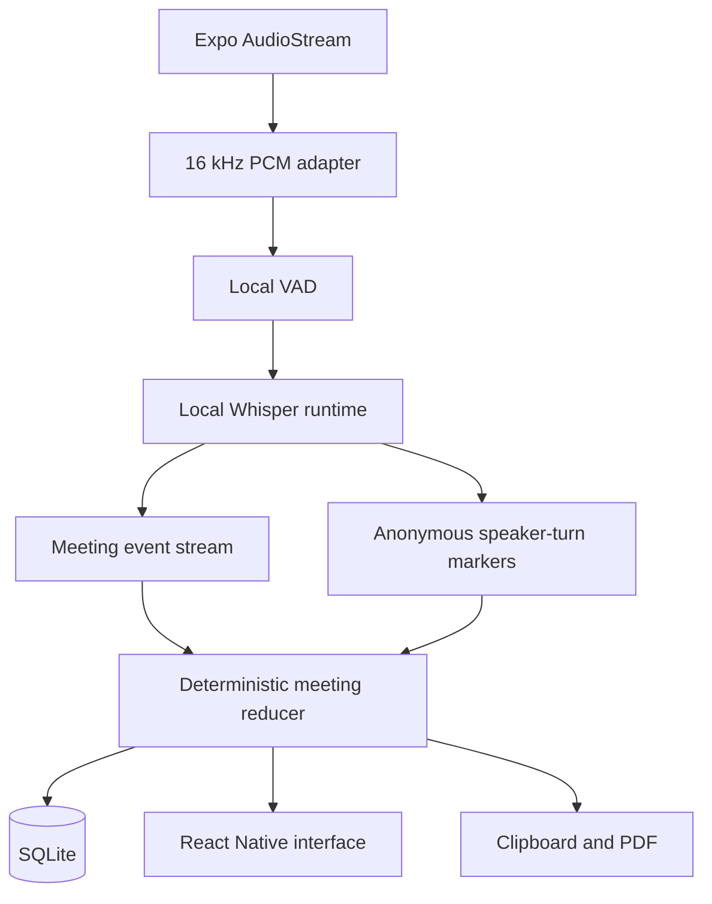

# Roomtone

**Meetings that remember.**

Roomtone is a local-first mobile meeting intelligence app for iOS and Android. It records a visibly consented meeting, produces an incremental transcript, detects anonymous speaker changes, highlights configured terms, derives evidence-linked meeting outcomes, preserves multilingual source text, and exports reusable meeting artifacts without requiring a Roomtone account or hosted backend.

## Product capabilities

- Live on-device transcription through `whisper.rn` and `whisper.cpp`
- Voice activity detection before inference
- Anonymous speaker-turn detection with human naming and correction
- Deterministic keyword highlighting without an LLM round trip
- Evidence-linked decisions, action items, questions, risks, and commitments
- Descriptive meeting dynamics such as talk time, turns, and outcome completeness
- Source-language preservation plus optional English translation
- Local meeting library and full-text search
- Quick-copy for transcript segments and complete meeting briefs
- On-device PDF generation for briefs, minutes, action registers, and transcripts
- Configurable local retention for audio and meeting records
- Guided demo runtime that exercises the full workflow in Expo Go
- Embedded build and physical-device diagnostics for APK validation

Roomtone deliberately avoids opaque employee productivity scores. It reports observable meeting dynamics and links every automated outcome back to transcript evidence.

## Architecture



The live audio path stays outside React rendering. React receives transcript, speaker, keyword, insight, metric, and runtime-status events. Final transcript segments and user edits are persisted immediately.

See [Architecture](docs/architecture.md) for the complete component model, event flow, persistence contract, timing model, and native-runtime boundaries.

## Execution modes

### Guided demo

The guided demo runs in Expo Go and uses a deterministic local meeting stream. It exercises:

- partial and final transcript states
- multiple named demo speakers
- keyword highlights
- English translation alongside preserved Spanish text
- decisions, actions, questions, and risks
- meeting dynamics
- search, clipboard, retention, and PDF export

### Native on-device audio

The native runtime requires a custom development or production build because `whisper.rn` includes native code.

It uses:

- Expo AudioStream for real-time PCM microphone capture
- a Roomtone adapter that downmixes and normalizes hardware audio to 16 kHz mono PCM
- Silero VAD through `whisper.rn`
- quantized Whisper models stored in the application sandbox
- optional TinyDiarize speaker-change markers

TinyDiarize detects anonymous turn changes. It does not identify a person and does not reliably reconnect every later turn to the same human speaker. Roomtone never invents identity. The repository includes a provider-neutral embedding-clustering implementation for a future verified speaker-embedding adapter.

## Build a Samsung Galaxy S24 Ultra APK

The repository includes a complete standalone APK path for physical-device testing.

### GitHub Actions

Run **Build Samsung S24 Ultra APK** from the Actions tab or open a pull request that changes the Android application. The workflow:

- runs all source validation
- performs a clean Expo Android prebuild
- builds a release-mode `arm64-v8a` APK
- embeds the JavaScript bundle, build SHA, version code, channel, and architecture
- verifies the signature, package name, and ZIP integrity
- uploads the APK and verification files as a 14-day workflow artifact

The preview package is `com.otey247.roomtone.preview`. The workflow artifact is standalone and does not require Metro.

### Local Windows build

```powershell
npm run apk:build:s24
npm run apk:install:s24
npm run apk:diagnostics:s24
```

### EAS internal build

```bash
npm run apk:build:eas
```

The `s24-apk` EAS profile creates an installable internal-distribution APK. The `production` profile continues to create an Android App Bundle.

See the complete [Samsung Galaxy S24 Ultra APK build and test guide](docs/samsung-s24-ultra-apk-testing.md).

## Getting started

### Prerequisites

- Node.js 22.18.0 or newer
- npm
- Xcode for iOS native builds
- JDK 17, Android Studio, and the Android SDK for Android native builds

### Install

```bash
npm install
```

### Run the guided demo

```bash
npm run start:go
```

Open the project in Expo Go, choose **Guided demo**, confirm the recording notice, and start the meeting.

### Run the native runtime

```bash
npm run prebuild
npm run ios
# or
npm run android
```

Then open **Settings**, download one speech model and the VAD model, select **On-device audio**, and start a meeting.

Model downloads are explicit user actions. After installation, the speech path can operate without a network connection.

## APK and device diagnostics

Native builds expose a diagnostics section in Settings that reports:

- application package, native version, build version, commit SHA, build channel, and architecture
- manufacturer, device model, Android version, API level, CPU architectures, and memory
- physical-device and Samsung S24 Ultra recognition
- microphone permission
- native Whisper availability
- application-sandbox availability
- active speech and VAD model readiness

The complete report can be copied for a test record. The ADB diagnostics script collects package state, app operations, memory, battery, device-idle state, foreground recording service state, and process logcat into a reviewable ZIP.

## Repository structure

```text
Roomtone/
├── src/app/                 Application state and routing
├── src/components/          Reusable production mobile components
├── src/data/                Guided demo fixtures
├── src/domain/              Meeting model, reducers, analytics, events, exports
├── src/hooks/               Live meeting session orchestration
├── src/inference/           Demo and native inference providers
├── src/infrastructure/      SQLite, files, clipboard, PDF, and diagnostics adapters
├── src/screens/             Complete mobile product surfaces
├── tests/domain/            Deterministic domain tests
├── tests/mobile/            Physical-device UI smoke flows
├── docs/                    Architecture, privacy, models, evaluation, and device testing
└── scripts/android/         APK build, install, and diagnostic tooling
```

## Quality gates

```bash
npm run verify:repo
npm run typecheck:domain
npm test
npm run typecheck
npm run typecheck:test
npm run doctor
```

The standard CI workflow installs dependencies, runs repository validation, performs application and test type checks, executes the deterministic test suite, runs Expo Doctor, and verifies Android prebuild generation.

The Samsung S24 Ultra workflow additionally produces and validates the standalone APK artifact.

## Privacy and recording safety

- A persistent live recording state remains visible during capture.
- Explicit participant-notification confirmation is enabled by default.
- Original and translated transcript text are stored separately.
- Meetings and model files remain in the application sandbox.
- Android backup is disabled for the generated Roomtone application.
- No Roomtone account or Roomtone cloud service is required.
- Same-phone capture of protected Zoom, Teams, Meet, or phone-call audio is not promised.
- Device backups outside Roomtone, operating-system telemetry, keyboards, and user-selected share targets remain outside Roomtone's control.

See [Privacy and security](docs/privacy-and-security.md) and [SECURITY.md](SECURITY.md).

## Current validation boundary

Automated source, TypeScript, deterministic domain, Expo Doctor, Android prebuild, APK packaging, APK signature, package identity, and archive-integrity checks are available.

A physical-device release gate is still required for:

- sustained 30, 60, and 120-minute recordings
- Samsung background and lock-screen behavior
- microphone interruptions and route changes
- thermal and battery behavior
- native model download, load, VAD, transcription, and translation
- speaker-turn error rate and human correction workflow
- PDF sharing on a real device

The detailed release matrix is in [Evaluation and release gates](docs/evaluation.md), and the S24-specific procedure is in [Samsung Galaxy S24 Ultra APK testing](docs/samsung-s24-ultra-apk-testing.md).

## License

MIT. See [LICENSE](LICENSE).
