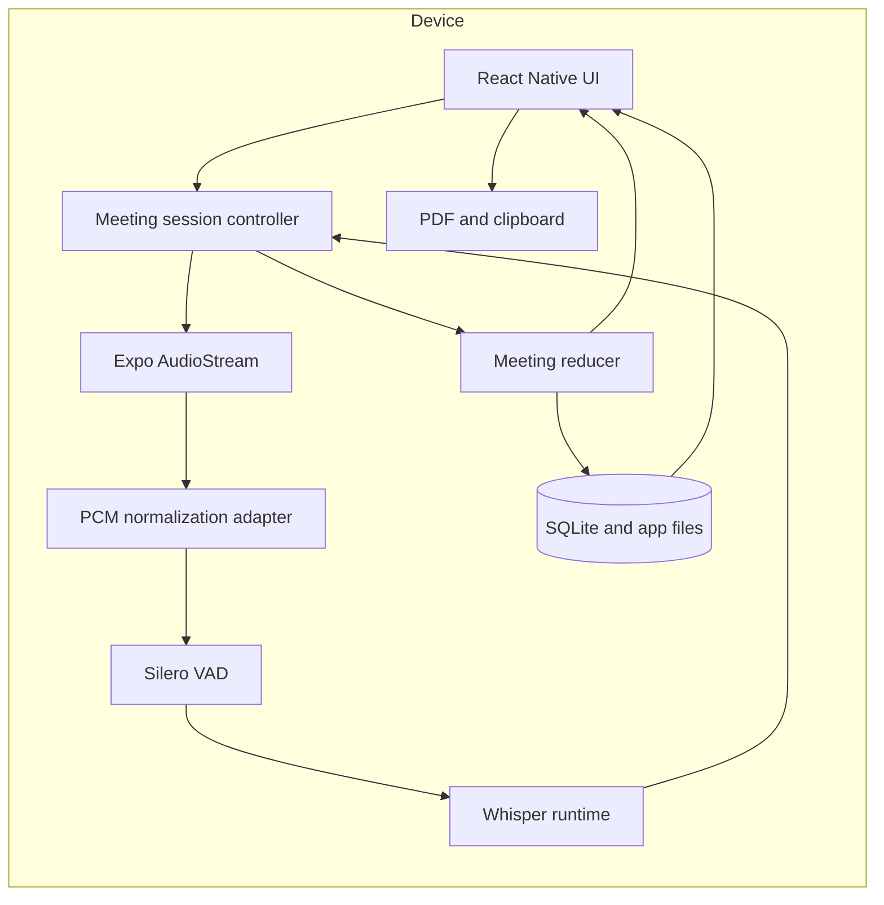

# Roomtone Architecture

## 1. Architectural intent

Roomtone is a local-first meeting intelligence system. The recording and transcript path must continue to work when a generative model is unavailable, the network is unavailable, or secondary analysis is paused because the device is under thermal or memory pressure.

The architecture separates five concerns:

1. Audio capture and normalization
2. Speech and speaker-turn inference
3. Meeting event processing
4. Deterministic analysis and persistence
5. Mobile presentation and export

## 2. Runtime topology



There is no mandatory Roomtone server in the core topology.

## 3. Audio plane

`useAudioStream` creates a native Expo audio stream. The `ExpoAudioStreamAdapter` implements the structural interface expected by the Whisper real-time transcriber.

The adapter:

- requests 16 kHz, mono, signed 16-bit PCM
- accepts the actual hardware sample rate and channel count
- downmixes interleaved channels to mono
- linearly resamples non-16 kHz input
- emits `Uint8Array` frames outside React render state
- exposes start, stop, status, data, and error callbacks

Audio capture has the highest operational priority. Transcript analysis, translation, metrics, and export must never block the capture callback.

## 4. Speech plane

The native provider loads:

- a Whisper speech model
- a Silero VAD model
- the `RealtimeTranscriber`
- a native file adapter for WAV persistence

VAD limits inference to speech-bearing buffers. Partial transcripts are emitted while a slice is active. Final transcript segments are emitted when the slice stabilizes.

### Evidence timing

The upstream real-time runtime reports slice duration in milliseconds. Roomtone uses the VAD event wall-clock timestamp relative to `Meeting.startedAt` when available. It preserves each slice's start boundary while partial text is revised and advances the final evidence cursor only when the slice stabilizes.

This prevents excluded silence from collapsing the evidence timeline and prevents millisecond values from being interpreted as seconds.

## 5. Speaker handling

Roomtone supports three levels of speaker information:

1. **Single anonymous voice**: standard Whisper models assign all speech to an anonymous local label.
2. **Anonymous speaker changes**: TinyDiarize-compatible models emit `[SPEAKER_TURN]` markers. Roomtone splits final text at those markers and creates anonymous turn labels.
3. **Verified clustering extension**: `speaker-clustering.ts` supplies cosine similarity, centroid updates, and threshold-based cluster creation for a future local speaker-embedding provider.

Roomtone does not infer a person's identity. A user may name anonymous labels. Any future enrollment flow must be explicit, local, revocable, and separately evaluated as biometric-like data processing.

## 6. Meeting event model

The session controller emits and persists events such as:

- `meeting.started`
- `transcript.segmentFinalized`
- `transcript.segmentCorrected`
- `speaker.created`
- `speaker.renamed`
- `bookmark.created`
- `meeting.stopped`

The persisted `Meeting` aggregate is a read model optimized for the mobile interface. Transcript segments are the canonical source for derived keyword occurrences, insights, summary text, and metrics.

Final transcript changes flow through `addFinalSegment`, which rebuilds affected derived data:

```text
Final segment
  -> ensure speaker
  -> replace segment version
  -> keyword matching
  -> deterministic insight extraction
  -> insight deduplication
  -> meeting metrics
  -> grounded summary
  -> SQLite snapshot
  -> append-only event
```

## 7. Deterministic intelligence

Roomtone intentionally makes the core workflow independent of a local LLM.

### Keyword detection

The keyword engine builds an Aho-Corasick-style trie from enabled terms and aliases. It performs boundary-aware matching and stores exact character offsets and transcript evidence timestamps.

### Outcome extraction

The deterministic extractor detects:

- explicit decisions and agreements
- action and next-step language
- owner candidates
- relative or explicit due text
- direct questions
- risks and dependencies
- first-person commitments

Every outcome stores a transcript segment ID and evidence timestamp. Automated observations are review aids, not authoritative meeting records.

### Meeting dynamics

Metrics include:

- talk time by anonymous or named speaker label
- participation percentage
- speaker-turn count
- questions, decisions, and actions
- actions with owners
- actions with due dates
- longest turn

Roomtone does not compute a single employee productivity score.

## 8. Multilingual contract

Each transcript segment preserves:

- `originalLanguage`
- `originalText`
- optional `translatedText`

The original is never overwritten by translation. Native English translation requires a multilingual Whisper model. Guided demo data exercises the same persistence and rendering contract.

## 9. Persistence

SQLite stores:

- meeting aggregate snapshots
- searchable normalized meeting text
- append-only meeting events
- application settings

Audio recordings and model files are stored in app-owned document directories. Retention policies run on application startup.

Database writes are serialized through a promise chain during a live session so final transcript updates retain order.

## 10. Export plane

Roomtone builds export HTML from the local aggregate and uses Expo Print to generate a PDF. Supported templates are:

- meeting brief
- complete minutes
- transcript
- action register

Outcome rows link to transcript anchors within the generated document. Clipboard exports use the same grounded meeting representation.

## 11. Failure behavior

The session controller preserves the following priorities:

1. microphone capture
2. final transcript persistence
3. partial transcript display
4. speaker-turn handling
5. deterministic analysis
6. translation
7. export

A translation error does not stop recording. An analysis error should not remove final transcript text. If native start fails, the meeting is finalized locally and the error is surfaced to the user.

## 12. Extension points

Stable interfaces exist for:

- `MeetingRuntime`
- `PcmAudioStream`
- model descriptors and model state
- speaker embedding clustering
- persistence and export adapters

Future providers may add Parakeet ASR, sherpa-onnx diarization, platform foundation models, or opt-in encrypted synchronization without changing the core meeting aggregate.
